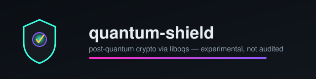

<p align="center">
  
</p>

<p align="center">
  
  
  
  
</p>
<p align="center">
  
  
  
  
  
  <a href="https://github.com/danindiana/quantum-shield/commits/master"></a>
</p>

---

# Quantum Shield

A post-quantum cryptography project: real key encapsulation and digital
signatures via [liboqs](https://github.com/open-quantum-safe/liboqs) (Open
Quantum Safe's C implementation of the NIST-standardized algorithms), plus
working post-quantum SSH key generation and TLS certificate issuance
through `openssl` + `oqs-provider`.

> ⚠️ **This is an experimental personal project. It has not been
> independently audited. Do not use it to protect anything you actually
> care about.** It calls into liboqs (which is itself under active
> development and not FIPS-certified) — it does not implement any
> cryptographic primitives of its own. Treat everything here as a learning
> and prototyping tool, not production security infrastructure.

## What actually works today

- **`src/algorithms/kem.py`** — `MLKEM768`: real keypair generation,
  encapsulation, and decapsulation via liboqs's `OQS_KEM` C API. Sizes
  (public key, secret key, ciphertext, shared secret) are read from the
  struct liboqs returns at runtime — not hardcoded.
- **`src/algorithms/signature.py`** — `Signature` (generic, takes any
  algorithm liboqs supports) plus `MLDSA65` and `Falcon512` convenience
  subclasses: real keypair generation, signing, and verification via
  liboqs's `OQS_SIG` C API, same struct-read approach.
- **`simple_ssh_keygen.py`** — generates real post-quantum SSH keypairs
  (ML-DSA-65 or Falcon-512) using the library above. Pass `--encrypt` to
  store the private key encrypted at rest (via `KeyStore`, passphrase
  prompted twice) instead of writing it as a plaintext file.
- **`test_pq_tls.py`** — generates real post-quantum TLS certificates by
  shelling out to `openssl` with the `oqs-provider` module loaded.
- **`quantum_shield.py benchmark`** — real timings (not simulated) for
  keypair/encaps/decaps/sign/verify, written to
  `benchmarks/results/<timestamp>.json`.
- **`quantum_shield.py server` + `examples/kem_demo_client.py`** — a real
  ML-KEM-768 key exchange over an actual TCP socket: the server generates
  a keypair, sends the public key, the client encapsulates and sends back
  a ciphertext, the server decapsulates — both sides print the identical
  shared secret. **This is a protocol demo, not a security protocol**: no
  authentication of the server's public key, no transport encryption, no
  replay protection. See [diagram 09](diagrams/09-demo-server-client.svg).
- **`src/kms/store.py`** — `KeyStore`: passphrase-encrypted at-rest
  storage for any keypair from the library above (AES-256-GCM, scrypt
  KDF, key name bound as AEAD associated data), wired into
  `simple_ssh_keygen.py --encrypt` (see above). Includes **key rotation**
  (`rotate_key()` archives the old generation, activates a new one under
  a possibly-different passphrase) and **revocation**
  (`revoke_key()` + `load_keypair(..., allow_revoked=True)`). See
  [diagram 10](diagrams/10-kms-store.svg),
  [diagram 11](diagrams/11-kms-rotation-revocation.svg),
  `examples/kms_demo.py`, and `examples/kms_rotation_demo.py`.
- **`src/pki/certs.py`** — verifies a real PQ-signed X.509 certificate's
  signature: parses structure via `cryptography`'s X.509 parser,
  extracts the raw public key from `SubjectPublicKeyInfo` via a small
  generic DER TLV walker, then checks the signature via
  `src/algorithms/signature.py`. **Never builds or encodes a
  certificate** — that stays delegated to `openssl`+`oqs-provider`
  (`test_pq_tls.py`); this only reads DER that openssl already produced
  correctly. Verified against real ML-DSA-65 and Falcon-512 certs
  generated fresh in the test suite. See
  [diagram 12](diagrams/12-pki-cert-verify.svg) and
  `examples/pki_verify_demo.py`.
- **48 passing tests** (`tests/test_kem.py`, `tests/test_signature.py`,
  `tests/test_setup.py`, `tests/test_kms.py`, `tests/test_pki_certs.py`)
  run against the actual installed `liboqs.so`, real `cryptography`
  primitives, and real certs generated by `openssl`+`oqs-provider` —
  round-trip encapsulate/decapsulate, sign/verify, encrypt/decrypt,
  certificate verification, and negative cases (tampered message, wrong
  key, wrong passphrase, wrong signer) — not mocks.

### A bug this refactor found and fixed

The project's original SSH keygen code hardcoded key sizes per algorithm
instead of reading them from liboqs — its own comment admitted this was a
placeholder. One of those hardcoded values was simply **wrong**: ML-DSA-65's
secret key was hardcoded as 4864 bytes; liboqs actually reports 4032.
Every SSH key generated by the old code was silently zero-padded to the
wrong length. The new `src/algorithms/signature.py` reads the real size
from the `OQS_SIG` struct instead, so this class of bug can't recur for
any algorithm liboqs supports — verified by comparing the new code's
reported sizes against the actual FIPS 203/204 spec sizes in
`tests/test_kem.py` / `tests/test_signature.py`.

### A second bug, found doing routine maintenance

The `Makefile`'s `test`/`setup`/`benchmark`/`status`/`server`/`install`
targets all used `source venv/bin/activate && <command>`. `make` runs
recipes with `/bin/sh` by default (dash on Debian/Ubuntu), which has no
`source` builtin — every one of those targets failed immediately with
`sh: 1: source: not found`, confirmed by actually running `make test` in
a clean environment. They'd been broken since this Makefile was first
written; nothing had ever run them. Fixed by invoking `venv/bin/python3`
directly instead of relying on shell activation, and by actually wiring
`make test` to run the pytest suite (48 tests) — it previously only ran
`quantum_shield.py`'s own basic self-check, never pytest at all. Verified
by creating a fresh venv from scratch via the new `make venv` target and
running every target through it.

## Quick start

The `Makefile` wraps most of this (`make venv && make test`); the manual
steps below are equivalent and useful if you want to see what each step
actually does:

```bash
git clone https://github.com/danindiana/quantum-shield.git
cd quantum-shield

# liboqs is NOT vendored in this repo (see "Building liboqs" below) --
# build it first, then:
export LD_LIBRARY_PATH="$HOME/.local/lib:$LD_LIBRARY_PATH"

python3 -m venv venv && source venv/bin/activate
pip install -r requirements.txt

# Run the test suite against your liboqs build
python3 -m pytest tests/test_kem.py tests/test_signature.py -v

# Generate post-quantum SSH keys
python3 simple_ssh_keygen.py

# Generate post-quantum TLS certificates (needs oqs-provider too)
export OPENSSL_MODULES="$HOME/.local/lib/ossl-modules"
python3 test_pq_tls.py
```

### Building liboqs

This repo intentionally does not vendor liboqs's ~400MB source tree —
clone and build it yourself:

```bash
git clone --depth 1 https://github.com/open-quantum-safe/liboqs.git
cmake -S liboqs -B liboqs/build -DCMAKE_INSTALL_PREFIX=$HOME/.local
cmake --build liboqs/build --parallel
cmake --install liboqs/build
```

For PQ TLS certificates, also build
[`oqs-provider`](https://github.com/open-quantum-safe/oqs-provider)
against the same liboqs install and set `OPENSSL_MODULES` to wherever it
installs `oqsprovider.so`.

## Using the library directly

```python
from src.algorithms.kem import MLKEM768
from src.algorithms.signature import MLDSA65

# Key exchange
kem = MLKEM768()
pk, sk = kem.generate_keypair()
ciphertext, shared_secret_a = kem.encapsulate(pk)
shared_secret_b = kem.decapsulate(sk, ciphertext)
assert shared_secret_a == shared_secret_b

# Signatures
sig = MLDSA65()
pk, sk = sig.generate_keypair()
signature = sig.sign(sk, b"a message")
assert sig.verify(pk, b"a message", signature)
```

```python
from src.kms.store import KeyStore

# Store any keypair from the library above, encrypted at rest
store = KeyStore()  # defaults to ~/.quantum-shield/keystore/
store.save_keypair("my-signing-key", "ML-DSA-65", "signature", pk, sk, "a strong passphrase")
loaded = store.load_keypair("my-signing-key", "a strong passphrase")
assert loaded["secret_key"] == sk
```

```python
from src.pki.certs import load_certificate, is_self_signed_and_valid

# Verify a real PQ X.509 cert (built by openssl+oqs-provider, see
# test_pq_tls.py), using only this project's own liboqs binding
cert = load_certificate(open("server.crt", "rb").read())
assert is_self_signed_and_valid(cert)  # signature + validity dates checked
```

## What's still planned

Carried over honestly from the project's own status tracking rather than
overstated: SSH deployment (`scripts/ssh/`) and TLS certificate generation
work today; `src/kms/` now has a real, tested key store with rotation and
revocation, wired into `simple_ssh_keygen.py --encrypt` (see above), but
still no hardware-backed storage or multi-user access control; `src/pki/`
now verifies certificate signatures (see above) but doesn't build
certificates, verify chains, or check revocation; full protocol
integration (`src/protocols/`) is still an empty directory — architecture
laid out, not yet implemented. See [`PROGRESS.md`](PROGRESS.md) and
[`docs/IMPLEMENTATION_PLAN.md`](docs/IMPLEMENTATION_PLAN.md).

## Diagrams

12 Graphviz diagrams (dark background / neon palette), source `.dot`
alongside rendered `.svg`/`.png` in [`diagrams/`](diagrams/):

| # | Diagram | What it shows |
|---|---|---|
| 01 | [System architecture](diagrams/01-system-architecture.svg) | Full module map, external deps, what's wired vs. not |
| 02 | [KEM flow](diagrams/02-kem-flow.svg) | ML-KEM-768 key exchange sequence, real byte sizes |
| 03 | [Signature flow](diagrams/03-signature-flow.svg) | Sign/verify sequence for ML-DSA-65 / Falcon-512 |
| 04 | [Struct binding approach](diagrams/04-struct-binding-approach.svg) | Before/after: the hardcoded-size bug vs. the struct-read fix |
| 05 | [Repo module map](diagrams/05-repo-module-map.svg) | What imports what, including the duplicated-loader finding |
| 06 | [Roadmap](diagrams/06-roadmap.svg) | Staged next steps, from `FUTURE_DIRECTIONS.md` |
| 07 | [Trust boundary](diagrams/07-trust-boundary.svg) | What's upstream/vetted vs. this repo's own (not audited) code |
| 08 | [Test coverage map](diagrams/08-test-coverage-map.svg) | What's covered by pytest vs. exercised manually vs. untested |
| 09 | [Demo server/client](diagrams/09-demo-server-client.svg) | The real over-the-wire ML-KEM-768 handshake, and its explicit non-goals |
| 10 | [KMS store](diagrams/10-kms-store.svg) | Passphrase-encrypted key storage: scrypt + AES-256-GCM save/load |
| 11 | [KMS rotation/revocation](diagrams/11-kms-rotation-revocation.svg) | Multi-generation rotation and revocation, with `allow_revoked=True` |
| 12 | [PKI cert verification](diagrams/12-pki-cert-verify.svg) | Verifying a real PQ X.509 cert's signature without reimplementing DER |

## Documentation

- [System Architecture](docs/SYSTEM_ARCHITECTURE.md) — actual code structure and data flow
- [Future Directions](docs/FUTURE_DIRECTIONS.md) — concrete next steps, checked not guessed
- [Research Notes](docs/RESEARCH_NOTES.md) — dated findings, including real timing measurements
- [Best Practices Log](docs/BEST_PRACTICES.md) — timestamped, tied to specific incidents (not generic advice)
- [Implementation Plan](docs/IMPLEMENTATION_PLAN.md)
- [NIST Standards Compliance](docs/NIST_COMPLIANCE.md)
- [Security Architecture](docs/SECURITY_ARCHITECTURE.md) — security design rationale
- [Deployment Guide](docs/DEPLOYMENT.md)
- [SSH Post-Quantum Guide](docs/SSH_POST_QUANTUM_GUIDE.md) / [Quick Deploy](SSH_QUICK_DEPLOY.md)
- [TLS/HTTPS PQ Research](docs/tls/TLS_PQ_RESEARCH.md)
- [Progress log](PROGRESS.md)

## Directory structure

```
quantum-shield/
├── src/
│   ├── algorithms/     # kem.py, signature.py -- the real, tested library
│   ├── kms/            # store.py -- encrypted key storage, wired into --encrypt
│   ├── pki/            # certs.py -- verifies PQ X.509 certs, never encodes one
│   └── {protocols,utils}/   # empty, planned
├── tests/               # pytest, runs against a real liboqs build
├── diagrams/            # 12 Graphviz diagrams, dark/neon, .dot + rendered
├── docs/                # architecture, future directions, research, best practices
├── scripts/             # SSH deployment automation
├── configs/              # SSH / algorithm configuration
├── benchmarks/           # timing results land here (gitignored)
├── examples/             # kem_demo_client.py, kms_demo.py, kms_rotation_demo.py,
│                         # pki_verify_demo.py
├── simple_ssh_keygen.py, test_pq_tls.py, test_liboqs.py
└── quantum_shield.py     # CLI entry point (setup/test/status/benchmark/server)
```

## License

MIT — see [LICENSE](LICENSE).
